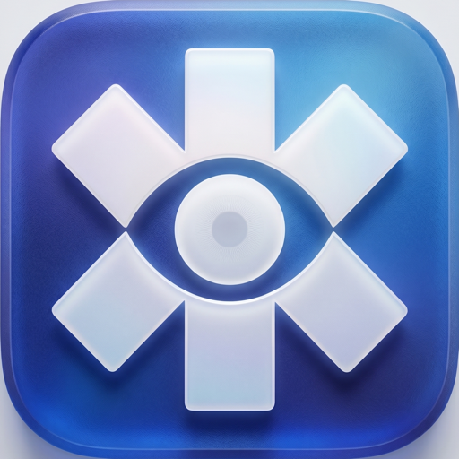
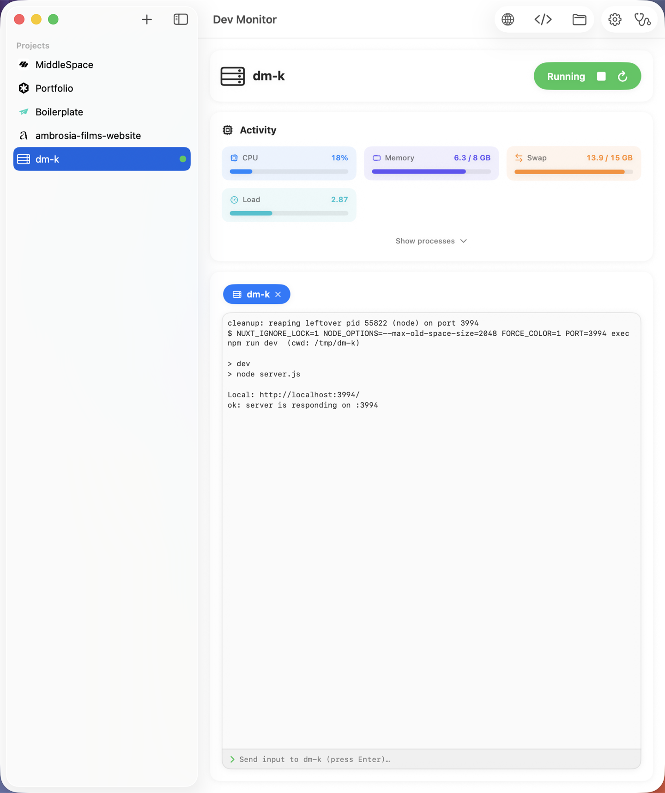

<div align="center">



# Dev Monitor

**A native macOS app that launches, supervises, and auto-recycles your JS/TS dev servers — so a hung Nuxt process never pins a CPU core again.**

Live resource graphs · hang detection · crash auto-revive · build runner · a hub every terminal routes through · Claude-powered diagnostics.

[](#requirements)
[](#requirements)


[Features](#features) · [Quick start](#quick-start) · [CLI](#command-line-interface) · [How it works](#under-the-hood) · [Architecture](docs/ARCHITECTURE.md)

</div>

---

Dev Monitor runs your dev servers the way a production process manager runs services: it **launches** them with the right heap, **watches** CPU/memory/health in real time, **recycles** them when they hang, **revives** them when they crash, and gives you **one place** — app, menu bar, or CLI — to see and control every server across every project.

> **Why it exists.** A doubled `npm` wrapper once left an orphaned Nuxt process listening on `:3000` but unresponsive — pinning a CPU core and dragging the whole Mac down, with nothing obvious to kill. Dev Monitor does that supervision properly and *visibly*, so it can't happen quietly again.

> **Built for small Macs.** Dev Monitor is tuned for machines where **RAM is the bottleneck** — an 8 GB Mac juggling a dev server, a production build, an editor and a browser. It actively manages that scarcity instead of leaving you to babysit Activity Monitor: heap that **autoscales** to what each project actually needs (and remembers it), dev servers **paused** to make room for a build, inactive memory **purged** before the kernel runs out of swap, and a **pressure system** that frees RAM *before* the machine grinds to a halt or the kernel starts SIGKILLing your build.

<div align="center">
  
  <br />
  <sub>A supervised server running with live CPU / memory / swap meters and its own terminal tab — the sidebar lists every project, each with a live status dot.</sub>
</div>

---

## Features

### 🚀 Detect &amp; launch
- **Auto-detects** the package manager (npm · pnpm · yarn · bun · deno) and framework (Nuxt · Next · Astro · SvelteKit · Remix · SolidStart · Angular · Qwik · Vite · Express) per project — and launches **any** project that has a `dev` script regardless. Framework-specific env (e.g. `NUXT_IGNORE_LOCK`) is applied only where it belongs.
- **Launches** the dev server with a deterministic heap size (`--max-old-space-size`), streaming its log live.
- **Per-project settings** (gear on each sidebar row): **Memory / Port / Package**, each with an **Auto** toggle (on by default) — flip it off for a manual value via slider, field, or package picker.

### 📊 Live activity &amp; metrics
- System **CPU / Memory / Swap** bars plus an Activity-Monitor-style table showing **only** the processes with real impact.
- **Every supervised server is its own identified row** — *MiddleSpace :3000* in **blue** — trees are never merged. A dev server running **outside** the app is identified the same way in **purple** (*MiddleSpace :3001*) so you can tell it apart at a glance; it's shown, not supervised.
- CPU is per-core (100% = one core, like Activity Monitor); a **"% of machine"** toggle re-expresses it as a share of total capacity.
- Generic helpers (`node`, *Code Helper*) are named from each extension's own `package.json` `displayName` — e.g. *Vue (Official)*, *ESLint*, *Tailwind CSS IntelliSense*.

### 🩺 Health, recovery &amp; resilience
- **Hang detection + auto-recycle** — HTTP-probes the server; after consecutive failures it kills the whole process tree (orphans included) and relaunches.
- **Crash auto-revive** — a server that *was* healthy then dies restarts with bounded backoff (1s → 2s → 4s, capped at 3 tries per stable run), with the **port pinned** so it doesn't drift.
- **OOM autoscaling** — in **auto** mode the heap starts at 4 GB and climbs **4 → 6 → 8** on each V8 out-of-memory, and the learned level is **remembered per project** so the next launch starts there instead of replaying the crashes. The dev server and the build keep **separate** learned levels. → [`docs/HEAP-AND-BUILD.md`](docs/HEAP-AND-BUILD.md)
- **Crash-proof supervision** — a managed server (or even the notification subsystem) failing can never take the app down with it.

### 🧯 Pressure response
Reclaims memory **before** the machine stalls — both when it's detected as *stuck* (CPU pinned, or memory full and swapping, for a sustained window) **and proactively around every build**:
- **Inactive memory is purged.** The system memory cache is released (`purge`) before a build and again mid-build under pressure — often a 1–2 GB swing — so a heavy build doesn't push the machine into swap exhaustion and a kernel SIGKILL (jetsam).
- **Orphaned dev processes auto-close.** A dev server detected by its real binary in argv (`…/.bin/nuxt`, `vite/bin/vite`, `next dev`, …) that isn't in the managed tree is killed (SIGTERM → SIGKILL) and a **notification** lists what was closed. The managed server, editor, and system are excluded.
- **Everything else stays a suggestion.** A sidebar panel surfaces other heavy processes — a fast **Haiku** evaluation of what's worth killing — each with a red **skull** button you press yourself. Critical processes (editor, WindowServer, Finder, daemons, Dev Monitor itself) are never suggested or auto-closed.

### 🔨 Build runner — tuned for tight RAM
- Runs the project's build as a **separate tracked tree** with its own Activity row and terminal tab; the **Build** button becomes a red **Stop build** while running. The CLI's `build` is **synchronous** — it waits for the build and reports the exit code plus a ✅/❌ verdict (so an agent or a script gets the real result).
- **Pauses all active dev servers** while building (relaunching them after): on an 8 GB Mac a build running alongside a multi-GB dev server gets SIGKILLed by the kernel before it can finish.
- **Autoscales the build heap** 4 → 6 → 8 on OOM, with its **own** learned level independent from the dev server's.
- **Frees RAM aggressively around the build**: `purge`s inactive/cached memory (before, and again under pressure during), surfaces the resource advisor to close heavy non-essential apps, watches memory pressure to act **before** the kernel jetsams the build, and runs Node with `--optimize-for-size`. → [`docs/HEAP-AND-BUILD.md`](docs/HEAP-AND-BUILD.md)

### 🖥️ Global terminal &amp; menu bar
- **Global terminal** — one resizable panel at the bottom of the detail pane with **one tab per running server and per build, across all projects** (*icon + project name + ✕*).
- **Global Activity** — the meters and process list always reflect the whole machine, not just the selected project.
- **Menu-bar item** (`MenuBarExtra`) — lists every **online server** (live status/uptime + Stop/Restart), every **build** in progress, and any **external** dev servers, plus a Launch button and a CPU/memory snapshot — without opening the window.
- **Appearance** — app-wide **Theme** (System / Light / Dark) and a separate **Terminal** theme for the log panes.

### ⌨️ CLI + central hub
- Drive everything from any terminal: `dev-monitor up` (idempotent) · `build` (**synchronous**; pauses servers + frees RAM) · `status [--json]` · `stop` · `restart` · `logs -f`. **One supervised server per project**, several concurrently; the CLI **auto-starts the app** if the hub isn't running. → [CLI reference](#command-line-interface)

### 🤖 Claude integration
- **Routes other Claude Code sessions through the app** — a global `PreToolUse` hook hard-blocks raw `npm run dev` / `nuxt dev` / framework builds and redirects to `dev-monitor`, so every terminal's servers land in one supervised place. → [`integrations/claude/`](integrations/claude/)
- **Diagnose** (read-only) — a toolbar button runs the logged-in `claude` against Dev Monitor's *own* source to explain its internal errors. Never edits anything (`--permission-mode plan`, write tools disallowed).
- **Resource advisor** (read-only) — Claude ranks the machine's heavy processes and proposes actions. Managed processes stop with one tap; **foreign processes are only closed after explicit confirmation — never auto-killed.**

---

## Quick start

```bash
# 1. Generate the Xcode project and build the app
brew install xcodegen
cd DevMonitor
xcodegen generate
xcodebuild -project DevMonitor.xcodeproj -scheme DevMonitor -configuration Debug \
  -derivedDataPath build build

# 2. Launch it
open "build/Build/Products/Debug/Dev Monitor.app"
```

Add a project from the sidebar, hit **Launch**, and the server comes up supervised with live graphs. To drive it from a terminal instead, see the [CLI](#command-line-interface).

### Download a release (no build needed)

Grab the latest build from [GitHub Releases](https://github.com/damiandania/DevMonitor/releases):

1. Download **`Dev Monitor-<version>.dmg`**, open it, and drag **Dev Monitor** into **Applications**.
2. The app is **unsigned** (no Apple Developer ID yet), so Gatekeeper blocks the first launch. Either **right-click the app → Open → Open**, or clear the quarantine flag once:
   ```bash
   xattr -dr com.apple.quarantine "/Applications/Dev Monitor.app"
   ```
3. Install the CLI from **`dev-monitor-<version>.zip`**:
   ```bash
   unzip dev-monitor-<version>.zip && mkdir -p ~/.local/bin && cp dev-monitor ~/.local/bin/ && chmod +x ~/.local/bin/dev-monitor
   ```

**Requires macOS 26 or later** (the UI uses SwiftUI / Liquid Glass). The CLI auto-starts the app when the hub isn't already running.

### Install a release build

A Release build installs the app to `/Applications` and the `dev-monitor` CLI to `~/.local/bin`:

```bash
xcodebuild -project DevMonitor.xcodeproj -scheme DevMonitor  -configuration Release -derivedDataPath build build
xcodebuild -project DevMonitor.xcodeproj -scheme dev-monitor -configuration Release -derivedDataPath build build
cp -R "build/Build/Products/Release/Dev Monitor.app" "/Applications/Dev Monitor.app"
cp    "build/Build/Products/Release/dev-monitor"      ~/.local/bin/dev-monitor
```

The app is **ad-hoc signed** (`CODE_SIGN_IDENTITY = -`) — no Apple Developer ID is installed on this machine, which is fine for local use. The CLI auto-starts the app via LaunchServices when the hub isn't already running. For distribution outside this Mac, sign with a Developer ID and notarize.

---

## Command-line interface

While the app is running it hosts a local hub (Unix socket). Any terminal — or a Claude Code session — can drive it with `dev-monitor` instead of running the dev server directly.

| Command | What it does |
|---|---|
| `dev-monitor up [path] [--gb N] [--wait]` | Start + supervise a project (default: cwd). **Idempotent**; `--gb N` pins the heap; `--wait` blocks until HTTP-ready and prints the URL. |
| `dev-monitor build [path]` | Build **alongside** the dev server (leaves it running); adds a build tab. |
| `dev-monitor status [--json]` | List every known project with state + port. `--json` adds `ready` · `url` · `pid` · `exitCode` · `lastError` · `logPath`. |
| `dev-monitor stop [path] [--all]` | Stop one server (default: cwd), or `--all`. |
| `dev-monitor restart [path]` | Relaunch from **any** state — including `Failed` / `Idle`. |
| `dev-monitor remove [path]` | Stop and **forget** the project. Aliases: `rm`, `forget`. |
| `dev-monitor logs [path] [-f]` | Print, or follow with `-f`, that project's own log. |
| `dev-monitor version` · `docs` | Version (`-v`) · help (`-h`, `--help`). |

Paths default to the current directory and resolve to absolute. Invalid input fails loudly: a non-project folder is rejected; unknown flags and a malformed `--gb` exit non-zero with a clear message. Full details — readiness semantics, heap sizing, failure diagnostics — in **[DevMonitor/USAGE.md](DevMonitor/USAGE.md)**.

```jsonc
// dev-monitor status --json  →  everything an agent needs to operate and self-correct
[
  { "name": "MiddleSpace", "path": "…/MiddleSpace", "state": "Running · :3000",
    "ready": true, "url": "http://localhost:3000/", "pid": 12345, "port": 3000,
    "logPath": "…/DevMonitor/logs/MiddleSpace-CA6AA3C8.log" }
]
```

---

## Requirements

- **macOS 26+** and **Xcode 26+** (Swift 6.3).
- [**XcodeGen**](https://github.com/yonsm/XcodeGen) (`brew install xcodegen`) to generate the project.
- The app is **not sandboxed** — it spawns processes and reads system-wide info.

---

## Architecture

A non-sandboxed SwiftUI app (`@Observable @MainActor` state) plus a small CLI target; long-running work — output streaming, sampling, health probing — runs off the main actor and hops back via `AsyncStream`. Full write-up in **[docs/ARCHITECTURE.md](docs/ARCHITECTURE.md)**.

```
DevMonitor/
  App/        @main App (WindowGroup + MenuBarExtra), AppState
  Model/      Project, AppSettings, SessionState, MetricPoint, IPCProtocol
  Store/      ProjectStore (Application Support JSON)
  Core/       Detector, DevSession (supervisor + metrics + health), ProcessTree,
              SystemSampler (+ pressure detection), BuildRunner, IPCServer,
              Notifier, ClaudeRunner, ResourceAdvisor
  Sys/        spawn.c (posix_spawn SETSID + CLOEXEC), metrics.c (libproc/mach),
              ipc.c, dm_exc.m (ObjC exception shim) + bridging header
  Views/      RootSplitView, DashboardView, GlobalTerminalView, MenuBarView,
              ActivityView, ProcessTableView, settings + Claude sheets
  Resources/  Assets.xcassets (AppIcon + skull + github), Info.plist
dev-monitor/  CLI target (IPC client, robust arg parsing in ArgParse.swift)
```

---

## Under the hood

A few non-obvious things this codebase gets right — each found and pinned down by the headless tests in [`tests/`](tests/):

- **`zsh -lc … exec`** (login, *not* interactive) so the user's PATH/fnm resolves, while avoiding the interactive `.zshrc` (p10k/fnm) that would reparent the real shell out of our process group. `exec` makes the dev process the session leader we spawned, so the whole tree stays enumerable and killable.
- **Enumeration by session id** (`getsid` + session-scoped pid scan), robust to process-group churn — so `killpg` reaps exactly what we measure.
- **CPU timebase conversion** — `proc_pid_rusage` returns CPU time in *mach* units on Apple Silicon (not nanoseconds); scaled via `mach_timebase_info` (1:1 on Intel).
- **Spawned servers don't inherit the IPC socket** — `POSIX_SPAWN_CLOEXEC_DEFAULT` (+ `FD_CLOEXEC` on the hub sockets) means a long-lived dev server can't hold the client socket open and block a cold-launch CLI call on `read()`.
- **Nuxt's dev-lock is agent-only** — `std-env` enables it whenever `CLAUDECODE` / `AI_AGENT` is set, so it fires inside Claude Code terminals. Servers spawn with `NUXT_IGNORE_LOCK=1`, and the app's own LaunchServices environment has no agent vars, so app-spawned servers never lock.
- **External dev servers are identified, not just listed** — argv that *looks like* a dev server is labelled *project :port* (project from the path before `/node_modules/`, port from a `proc_pidfdinfo` scan for the LISTENing socket), flagged external, and shown but never supervised.
- **Notifications can't crash the app** — `UNUserNotificationCenter` can raise an Objective-C `NSException` (which Swift can't `try`/`catch`) on a bundle the daemon rejects, so every notification call is routed through a tiny ObjC `@try/@catch` shim (`dm_try`).
- **Deterministic heap sizing** — in auto mode it follows the framework default (Nuxt/Next 8 · Astro/Vite 4 · Node 2), never a stale stored value; floored at 2 GB, capped at physical RAM.

---

## Testing

`bash tests/run-tests.sh` is the one command that verifies the whole project, in two phases (add `--unit` to skip the slower Phase 1):

- **Phase 1 — full compile.** Regenerates the project and builds *both* targets (app + CLI), catching SwiftUI/view errors the standalone suites can't.
- **Phase 2 — headless unit suites.** Each compiles the real source files standalone with `swiftc` (no Xcode host, no GUI): **spawn** · **metrics** · **detector** · **model** · **sampler** · **session** · **argparse** · **advisor**.

When adding a feature, prefer extracting its decision logic into a pure (ideally `nonisolated static`) function so it's unit-testable here, then add or extend a suite. The Claude integrations reuse the same read-only `ClaudeRunner.run` path and were additionally verified live against the logged-in `claude` CLI.

---

<details>
<summary><b>Development history</b> — phase log (P0 → P11)</summary>

<br />

| Phase | Summary |
|---|---|
| **P0** — Scaffold | XcodeGen project (app + CLI), persistent project sidebar, Dock icon |
| **P1** — Launch &amp; log | Detector + supervisor (`posix_spawn` session, `killpg`), log streaming, port/ready parsing, `NODE_OPTIONS` |
| **P2** — Metrics &amp; charts | Per-process CPU/mem (`libproc`), system CPU/mem (`mach`), live Swift Charts |
| **P3** — Health &amp; recycle | HTTP health probe + strike state machine + automatic tree recycle |
| **P4** — Notifications | Native notifications (crash/hang/recycle/build) with sound |
| **P5** — Build runner | Run the project's build script as a tracked tree |
| **P6** — Hub + CLI + docs | Unix-socket hub + `dev-monitor` CLI + auto-start |
| **P7** — Claude reports | Read-only "Diagnose" report about Dev Monitor itself |
| **P8** — Polish &amp; dist | App icon, MenuBarExtra, Release → /Applications, CLI → `~/.local/bin` (ad-hoc signing) |
| **P9** — Resource advisor | Claude-recommended actions on heavy processes; confirm before closing foreign |
| **P9b** — Pressure auto-kill | Stuck-machine detection → auto-closes orphaned dev processes; others surfaced via fast Haiku eval + manual skull |
| **P10** — Multi-session orchestrator | One supervised server per project (concurrent), global terminal + Activity, build alongside server, external servers identified, single main window, theming, Claude routing hook |
| **P11** — Agent-operable CLI | Deterministic heap + OOM auto-retry, path validation, restart-from-any-state, per-project logs, `up --wait`, structured `status --json`, crash-proof supervision |

</details>

---

## License

Released under the [MIT License](LICENSE) — free to use, copy, modify, and distribute, provided the copyright notice is preserved. © 2026 Damian.
